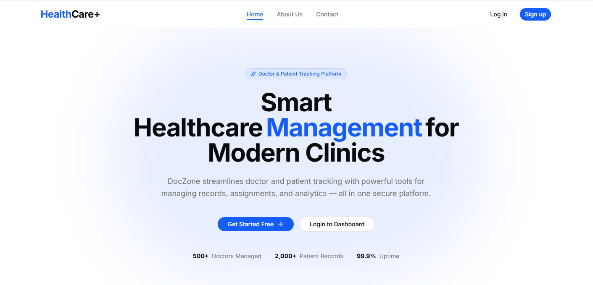
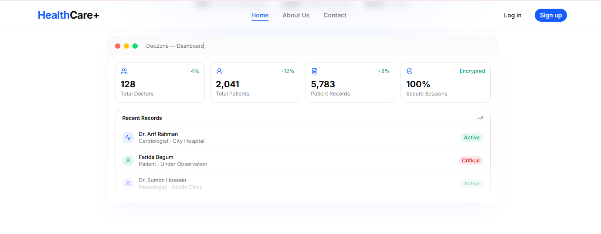

# HealthCare+ — Doctor & Patient Tracker

> A secure, full-stack administrative portal for managing doctors and patients — built with Next.js 16, MongoDB, and shadcn/ui.

---

## Table of Contents

- [Description](#description)
- [Live Demo](https://doctortracker.vercel.app/)
- [Setup Guide](#setup-guide)
- [System Architecture](#system-architecture)
- [API Routes Reference](#api-routes-reference)
- [Technical Decisions](#technical-decisions)
- [Database Schema and Indexes](#database-schema-and-indexes)
- [Visual Evidence](#visual-evidence)
- [Tech Stack](#tech-stack)
- [Security Considerations](#security-considerations)

---

## Description

**DocZone** is a production-ready, role-based healthcare management portal that enables hospital administrators to register and manage doctors, track patient records, assign patients to doctors, and monitor key clinic analytics — all from a single, secure dashboard. Built as a full-stack Next.js application, it combines RESTful API routes with a modern React frontend, MongoDB for persistent storage, and JWT-based authentication with fine-grained role-based access control (RBAC) for Admin, Doctor, and Patient roles.

---

## Live Demo

| Resource              | URL                                                 |
| --------------------- | --------------------------------------------------- |
| **Live App**          | `https://doctortracker.vercel.app`                  |
| **GitHub Repo**       | `https://github.com/pmppiyas/health_care_fullstack` |
| **Admin Credentials** | Email: `admin@gmail.com` · Password: `Admin123`     |

---

## Setup Guide

### Prerequisites

- Node.js `>= 18.x`
- pnpm `>= 9.x` → `npm install -g pnpm`
- MongoDB Atlas cluster (or local MongoDB `>= 6.x`)

### 1. Clone the Repository

```bash
git clone https://github.com/pmppiyas/health_care_fullstack
cd doczone/fullstack
```

### 2. Install Dependencies

```bash
pnpm install
```

### 3. Configure Environment Variables

```bash
cp .env.example .env
```

Open `.env` and fill in your values:

```env
# MongoDB
MONGODB_URI="mongodb+srv://<user>:<password>@cluster0.xxxxx.mongodb.net/doctZone?retryWrites=true&w=majority"

# Admin Seed (used by `pnpm seed:admin`)
ADMIN_EMAIL=admin@gmail.com
ADMIN_PASS=Admin123!

# Bcrypt
SALT_ROUND=12

# JWT
JWT_ACCESS_SECRET=your_super_secret_key_minimum_32_characters
JWT_ACCESS_EXPIRED=7d
```

### 4. Seed the First Admin

Before logging in, create the super-admin account:

```bash
pnpm seed:admin
```

This script creates a `User` (role: `ADMIN`) and links it to an `Admin` profile using the `ADMIN_EMAIL` and `ADMIN_PASS` from your `.env`.

### 5. Run the Development Server

```bash
pnpm dev
```

Open **http://localhost:3000** in your browser.

### Available Scripts

| Command           | Description                    |
| ----------------- | ------------------------------ |
| `pnpm dev`        | Start development server       |
| `pnpm build`      | Build production bundle        |
| `pnpm start`      | Start production server        |
| `pnpm seed:admin` | Seed the initial admin user    |
| `pnpm typecheck`  | Run TypeScript type checker    |
| `pnpm format`     | Format all files with Prettier |

---

## System Architecture

### High-Level Data Flow

```
Browser (React / Next.js RSC)
        │
        │  fetch() / Server Actions
        ▼
┌─────────────────────────────────────────────────────┐
│                 Next.js App Router (v16)             │
│                                                     │
│  ┌───────────────────────────────────────────────┐  │
│  │              Middleware Layer                  │  │
│  │                                               │  │
│  │  withValidation      → public routes          │  │
│  │  withAuth            → role-protected routes  │  │
│  │  withAuthAndValidation → auth + body parsing  │  │
│  │                                               │  │
│  │  Every middleware calls connectDB() first     │  │
│  └───────────────────────────────────────────────┘  │
│                        │                            │
│  ┌─────────────────────▼───────────────────────┐   │
│  │           Controller  →  Service             │   │
│  │   (HTTP shape)          (Business logic)     │   │
│  └─────────────────────┬───────────────────────┘   │
└────────────────────────┼────────────────────────────┘
                         │
              ┌──────────▼──────────┐
              │    MongoDB Atlas     │
              │                     │
              │  Collections:       │
              │  ├── users          │
              │  ├── admins         │
              │  ├── doctors        │
              │  ├── patients       │
              │  └── doctorpatients │
              └─────────────────────┘
```

### Folder Structure

```
fullstack/
├── app/
│   ├── (commonLayout)/          # Public pages (Home, About, Contact)
│   │   ├── layout.tsx           # Shared Navbar + Footer
│   │   └── page.tsx             # Landing page
│   └── api/                     # REST API (Next.js Route Handlers)
│       ├── auth/
│       │   ├── login/route.ts        # POST /api/auth/login
│       │   └── logout/route.ts       # POST /api/auth/logout
│       ├── user/
│       │   ├── route.ts              # GET /api/user
│       │   └── [userId]/
│       │       ├── route.ts          # GET · PATCH · DELETE
│       │       └── status/route.ts   # PATCH /api/user/:id/status
│       ├── admin/
│       │   ├── route.ts              # POST · GET /api/admin
│       │   └── [adminId]/
│       │       ├── route.ts          # GET · PATCH · DELETE
│       │       └── permissions/      # POST · DELETE
│       ├── doctor/
│       │   ├── route.ts              # POST · GET /api/doctor
│       │   └── [doctorId]/
│       │       ├── route.ts          # GET · PATCH · DELETE
│       │       └── patients/
│       │           ├── route.ts      # POST · GET
│       │           └── [patientId]/  # DELETE (unassign)
│       ├── patient/
│       │   ├── route.ts              # POST · GET /api/patient
│       │   └── [patientId]/
│       │       ├── route.ts          # GET · PATCH · DELETE
│       │       └── doctors/route.ts  # GET assigned doctors
│       └── doctor-patient/
│           ├── route.ts              # GET all assignments
│           └── [assignmentId]/       # GET · PATCH · DELETE
│
├── components/
│   ├── home/                    # Landing page sections
│   ├── shared/                  # Navbar, Footer, Logo
│   └── ui/                      # shadcn/ui primitives
│
├── config/
│   ├── db.config.ts             # Mongoose + globalThis connection caching
│   └── env.config.ts            # Zod-validated env schema
│
├── lib/
│   ├── error/
│   │   ├── AppError.ts          # Custom operational error class
│   │   └── handleError.ts       # Converts any error to HTTP shape
│   ├── token/                   # JWT sign + verify
│   ├── auth/                    # bcrypt hash + compare
│   └── utils/sendResponse.ts    # Unified NextResponse builder
│
├── middleware/
│   ├── withAuth.ts              # JWT guard + RBAC + connectDB
│   ├── withValidation.ts        # Zod body validation + connectDB
│   └── withAuthAndValidation.ts # Composed auth + validation
│
├── interfaces/                  # Shared TypeScript types
├── scripts/admin.seed.ts        # One-time admin bootstrapper
└── .env.example
```

---

## API Routes Reference

All responses follow a unified format:

```json
{
  "success": true,
  "message": "Operation successful",
  "data": [],
  "meta": { "total": 100, "page": 1, "limit": 10, "totalPages": 10 }
}
```

Error response:

```json
{ "success": false, "message": "Patient not found" }
```

### Auth

| Method | Endpoint           | Auth   | Description                |
| ------ | ------------------ | ------ | -------------------------- |
| `POST` | `/api/auth/login`  | Public | Authenticate → returns JWT |
| `POST` | `/api/auth/logout` | Public | Clear auth session         |

**Login Request:**

```json
{ "email": "admin@gmail.com", "password": "Admin123!" }
```

**Login Response:**

```json
{
  "success": true,
  "data": {
    "accessToken": "eyJhbGciOiJIUzI1NiIsInR5cCI6IkpXVCJ9...",
    "user": { "id": "...", "name": "Admin", "email": "...", "role": "ADMIN" }
  }
}
```

### User

| Method   | Endpoint                   | Auth                     | Description     |
| -------- | -------------------------- | ------------------------ | --------------- |
| `GET`    | `/api/user`                | Admin                    | List users      |
| `GET`    | `/api/user/:userId`        | Admin · Doctor · Patient | Get single user |
| `PATCH`  | `/api/user/:userId`        | Admin                    | Update user     |
| `DELETE` | `/api/user/:userId`        | Admin                    | Delete user     |
| `PATCH`  | `/api/user/:userId/status` | Admin                    | Set status      |

**Query params:** `?search=&role=DOCTOR&status=ACTIVE&page=1&limit=10`

**Status values:** `ACTIVE` · `INACTIVE` · `BLOCKED`

### Admin

| Method   | Endpoint                          | Auth  | Description          |
| -------- | --------------------------------- | ----- | -------------------- |
| `POST`   | `/api/admin`                      | Admin | Create admin profile |
| `GET`    | `/api/admin`                      | Admin | List admins          |
| `GET`    | `/api/admin/:adminId`             | Admin | Get admin            |
| `PATCH`  | `/api/admin/:adminId`             | Admin | Update admin         |
| `DELETE` | `/api/admin/:adminId`             | Admin | Delete admin         |
| `POST`   | `/api/admin/:adminId/permissions` | Admin | Grant permission     |
| `DELETE` | `/api/admin/:adminId/permissions` | Admin | Revoke permission    |

**Permissions:** `MANAGE_USERS` · `MANAGE_DOCTORS` · `MANAGE_PATIENTS` · `VIEW_REPORTS` · `SYSTEM_SETTINGS` · `SUPER_ADMIN`

### Doctor

| Method   | Endpoint                                    | Auth           | Description                |
| -------- | ------------------------------------------- | -------------- | -------------------------- |
| `POST`   | `/api/doctor`                               | Admin          | Create doctor              |
| `GET`    | `/api/doctor`                               | All            | List doctors               |
| `GET`    | `/api/doctor/:doctorId`                     | Admin · Doctor | Get doctor                 |
| `PATCH`  | `/api/doctor/:doctorId`                     | Admin          | Update doctor              |
| `DELETE` | `/api/doctor/:doctorId`                     | Admin          | Delete doctor              |
| `POST`   | `/api/doctor/:doctorId/patients`            | Admin · Doctor | Assign patient to doctor   |
| `GET`    | `/api/doctor/:doctorId/patients`            | Admin · Doctor | List doctor's patients     |
| `DELETE` | `/api/doctor/:doctorId/patients/:patientId` | Admin · Doctor | Remove patient from doctor |

**Query params:** `?search=&specialization=Cardiology&hospital=City+Hospital&page=1&limit=10`

**Create Doctor Body:**

```json
{
  "userId": "683abc...",
  "name": "Dr. Arif Rahman",
  "specialization": "Cardiology",
  "hospital": "City Hospital",
  "department": "Cardiac ICU",
  "licenseNumber": "LIC-2024-001",
  "phone": "+8801700000000",
  "email": "arif@hospital.com",
  "yearsOfExperience": 12,
  "consultationFee": 800,
  "qualifications": ["MBBS", "MD (Cardiology)"],
  "isAvailable": true
}
```

### Patient

| Method   | Endpoint                          | Auth                     | Description           |
| -------- | --------------------------------- | ------------------------ | --------------------- |
| `POST`   | `/api/patient`                    | Admin                    | Create patient        |
| `GET`    | `/api/patient`                    | Admin                    | List patients         |
| `GET`    | `/api/patient/:patientId`         | Admin · Doctor · Patient | Get patient           |
| `PATCH`  | `/api/patient/:patientId`         | Admin                    | Update patient        |
| `DELETE` | `/api/patient/:patientId`         | Admin                    | Delete patient        |
| `GET`    | `/api/patient/:patientId/doctors` | Admin · Doctor · Patient | Get patient's doctors |

**Query params:** `?search=&status=Active&gender=Female&page=1&limit=10`

**Patient status values:** `Active` · `Discharged` · `Critical` · `Recovered` · `Under Observation`

**Create Patient Body:**

```json
{
  "userId": "683abc...",
  "name": "Farida Begum",
  "age": 45,
  "gender": "Female",
  "bloodGroup": "B+",
  "phone": "+8801800000000",
  "email": "farida@example.com",
  "address": "Dhaka, Bangladesh",
  "condition": "Hypertension",
  "diagnosis": "Stage 2 hypertension",
  "allergies": ["Penicillin"],
  "currentMedications": ["Amlodipine 5mg"],
  "status": "Active",
  "admissionDate": "2025-01-10T00:00:00.000Z",
  "emergencyContact": {
    "name": "Karim Hossain",
    "relationship": "Husband",
    "phone": "+8801900000000"
  }
}
```

### Doctor-Patient Assignments

| Method   | Endpoint                            | Auth           | Description                      |
| -------- | ----------------------------------- | -------------- | -------------------------------- |
| `GET`    | `/api/doctor-patient`               | Admin          | List all assignments (paginated) |
| `GET`    | `/api/doctor-patient/:assignmentId` | Admin · Doctor | Get single assignment            |
| `PATCH`  | `/api/doctor-patient/:assignmentId` | Admin          | Update relationship type         |
| `DELETE` | `/api/doctor-patient/:assignmentId` | Admin          | Delete assignment                |

**Relationship types:** `Primary` · `Secondary` · `Consultant`

---

## Technical Decisions

### Decision 1: Composable Middleware Wrappers

Instead of duplicating auth and validation logic in every route, we built three composable higher-order functions:

```typescript
// middleware/withAuth.ts
export function withAuth(...allowedRoles: Role[]) {
  return (handler: AuthenticatedHandler) =>
    async (req: NextRequest, context: RouteContext) => {
      try {
        await connectDB()  // always connect first

        const token =
          req.cookies.get("access-token")?.value ??
          req.headers.get("authorization")?.substring(7)

        if (!token) return json({ message: "No token" }, 401)

        const payload = verifyToken(token, ENV.JWT_ACCESS_SECRET) as AuthUser

        if (!allowedRoles.includes(payload.role))
          return json({ message: "Forbidden" }, 403)

        return await handler(req, context, payload)
      } catch (error) {
        const { statusCode, message } = handleError(error)
        return json({ success: false, message }, statusCode)
      }
    }
}

// Route — single-responsibility, no boilerplate
export const PATCH = withAuthAndValidation(
  updatePatientSchema,
  [Role.ADMIN],
  async (req, context, user, data) => {
    const { patientId } = await context.params
    return await PatientController.updatePatient(patientId, data, user)
  }
)
```

**Why:** Every route is a one-liner. Auth, DB connection, validation, and error handling live in shared layers — not scattered across 30+ route files.

---

### Decision 2: AppError + Global handleError Pattern

Services throw typed errors. Middleware converts them to HTTP responses:

```typescript
// lib/error/AppError.ts
export class AppError extends Error {
  constructor(
    public statusCode: number,
    message: string,
    public isOperational = true
  ) {
    super(message)
    Error.captureStackTrace(this, this.constructor)
  }
}

// lib/error/handleError.ts
export const handleError = (error: unknown) => {
  if (error instanceof AppError)
    return { statusCode: error.statusCode, message: error.message }

  if (error instanceof ZodError)
    return { statusCode: 400, message: "Validation Error" }

  if (error instanceof Error)
    return { statusCode: 500, message: error.message }

  return { statusCode: 500, message: "Something went wrong" }
}

// In any service — pure logic, zero HTTP concerns
const getPatientById = async (patientId: string) => {
  const patient = await Patient.findById(patientId)
  if (!patient) throw new AppError(404, "Patient not found")
  return patient
}
```

**Why:** Services are fully decoupled from HTTP. The same service can be called from routes, scripts, or tests without any adaptation.

---

### Decision 3: MongoDB Connection Caching via globalThis

```typescript
// config/db.config.ts
const g = globalThis as unknown as {
  mongoose: { conn: typeof mongoose | null; promise: Promise<typeof mongoose> | null }
}

if (!g.mongoose) g.mongoose = { conn: null, promise: null }

export const connectDB = async () => {
  if (g.mongoose.conn) return g.mongoose.conn  // reuse existing connection

  if (!g.mongoose.promise)
    g.mongoose.promise = mongoose.connect(MONGODB_URI)

  g.mongoose.conn = await g.mongoose.promise
  return g.mongoose.conn
}
```

**Why:** Next.js API routes are stateless. Without caching, each hot-reload in dev or each serverless invocation in production creates a new Mongoose connection, exhausting MongoDB Atlas's connection pool limit. The `globalThis` object persists across hot-reloads and invocations.

---

## Database Schema and Indexes

### Key Indexes for Performance

```typescript
// Patients — search, filter, date sort
patientSchema.index({ status: 1 })
patientSchema.index({ admissionDate: -1 })
patientSchema.index({ gender: 1 })
patientSchema.index({ doctorIds: 1 })


doctorSchema.index({ specialization: 1 })
doctorSchema.index({ hospital: 1 })
doctorSchema.index({ licenseNumber: 1 })


doctorPatientSchema.index({ doctorId: 1, patientId: 1 }, { unique: true })
doctorPatientSchema.index({ doctorId: 1, assignedAt: -1 })
doctorPatientSchema.index({ patientId: 1, assignedAt: -1 })
```

### Paginated Query Pattern (all list routes)

```typescript
const [results, total] = await Promise.all([
  Model.find(filter)
    .sort({ createdAt: -1 })
    .skip((page - 1) * limit)
    .limit(limit)
    .lean(),  // lean() skips Mongoose hydration — ~30% faster reads
  Model.countDocuments(filter),
])
```

---

## Visual Evidence

| View                   | Screenshot                                                |
| ---------------------- | --------------------------------------------------------- |
| Landing Page — Desktop |          |
| Admin Dashboard        |     |
| Doctor Management      |  |
| Patient Records        | _( screenshot)_                                           |
| Mobile Responsive      | _(screenshot)_                                            |

---

## Tech Stack

| Layer          | Technology                | Version |
| -------------- | ------------------------- | ------- |
| Framework      | Next.js (App Router, RSC) | 16.x    |
| Language       | TypeScript                | 5.x     |
| Database       | MongoDB via Mongoose      | 9.x     |
| Authentication | JWT + bcrypt              | —       |
| Validation     | Zod                       | 3.x     |
| UI Components  | shadcn/ui + Radix UI      | —       |
| Styling        | Tailwind CSS              | 4.x     |
| Forms          | React Hook Form           | 7.x     |
| Icons          | Lucide React              | —       |
| Notifications  | Sonner (toast)            | —       |
| Linting        | ESLint + Prettier         | —       |

---

## Security Considerations

| Concern          | Implementation                                                            |
| ---------------- | ------------------------------------------------------------------------- |
| Authentication   | JWT verified on every protected request via middleware                    |
| Authorization    | RBAC — Admin / Doctor / Patient have distinct permissions                 |
| Password Storage | bcrypt with `SALT_ROUND=12`                                               |
| Input Validation | Zod schemas on all request bodies                                         |
| DB Validation    | Mongoose validators act as a second layer                                 |
| Blocked Users    | Denied access even with a valid JWT                                       |
| Env Validation   | Zod parses `process.env` at startup — app will not boot with missing keys |

---

## License

MIT © 2025 HealthCare+ - Prince Mahmud Piyas
